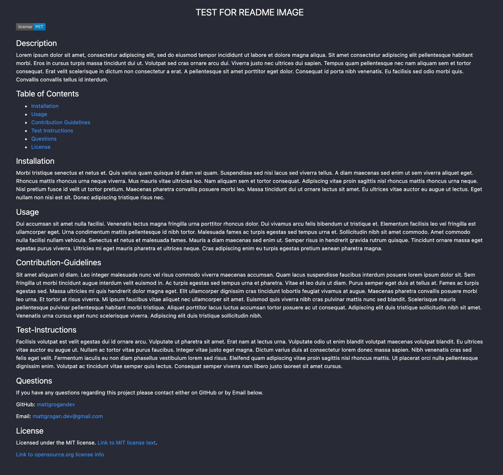
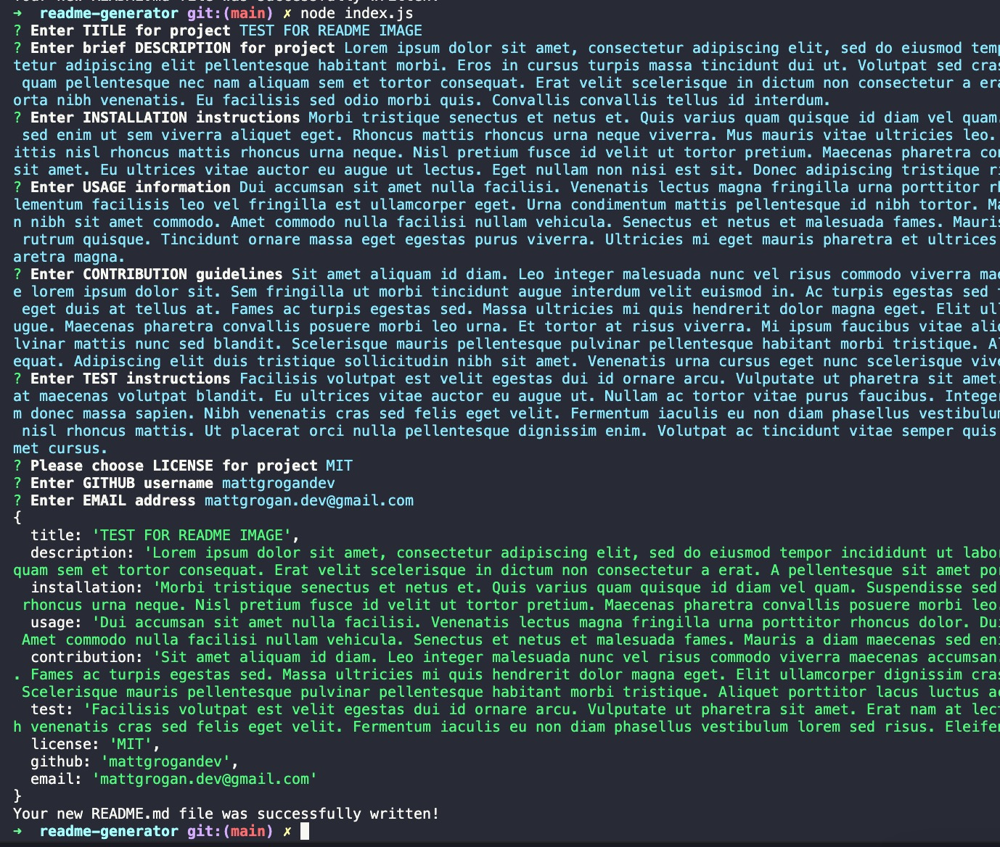

  README GENERATOR 

## Description

For this project I created a README generator to use as a template for future projects. This uses inquirer, gives a series of prompts to fill out regarding the project, and then generates a new README file.

## Table of Contents

- [Installation](#installation)
- [Usage](#usage)
- [Questions](#questions)
- [Video](#video-demonstration)
- [Sample-README](#sample-readme)
- [Images](#images)
- [License](#license)

## Installation

When you open the file, run "node index.js" to start prompts. Fill out the details and select the license you would like to use. Once you have answered all of the info a new README file will be created called README1. Copy this file and paste it into whatever new project you are working on.

## Usage

Use this for a simple README template so that you can quickly generate a README file with all of the relevant information on your project.

## Questions

If you have any questions regarding this project please contact either on GitHub or by Email below.

GitHub: [mattgrogandev](https://github.com/mattgrogandev)

Email: mattgrogan.dev@gmail.com

## Video-Demonstration

[Video-Demonstration](https://watch.screencastify.com/v/PmvxxVuk5ZVObvA3ZQ1E)

## Sample-README

[Sample-README](https://github.com/mattgrogandev/sample-readme)

## Images

SAMPLE OF GENERATED README FILE

VIEW OF PROMPTS ON TERMINAL

## License

Licensed under the MIT license. [Link to MIT license text](MIT.txt).

[Link to opensource.org license info](https://opensource.org/licenses/MIT)
